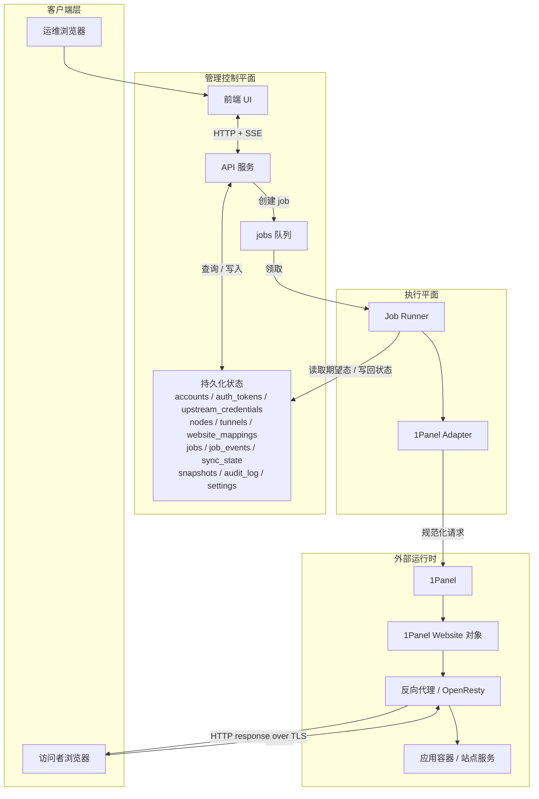
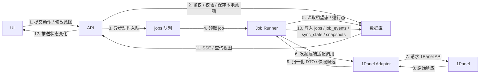
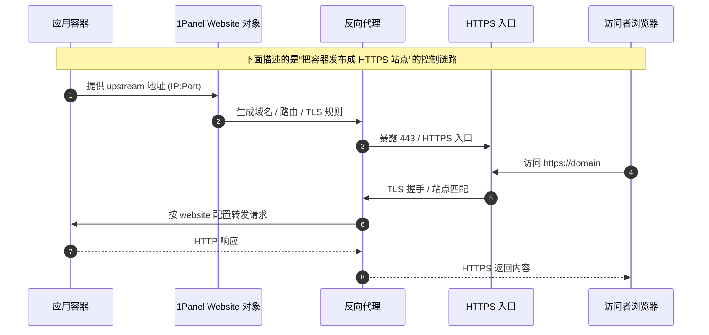

# 架构图 / 数据流 / 发布链路

> 适用范围：`ashan-frp` 的管理台、调度层、1Panel 适配层与站点发布链路。
> 约束：只描述逻辑拓扑、运行时边界和数据流，不包含实现代码、迁移脚本或 ORM 代码。
> 说明：本文与 `backend-schema.md`、`frontend-ui.md`、`job-event-model.md` 配套阅读。

## 1. 设计目标

这份图的目标不是“把所有组件画出来”，而是让读者在 1 分钟内回答四个问题：

1. 哪些动作是同步的，哪些动作是异步的？
2. UI、API、job runner、1Panel adapter 的职责边界在哪里？
3. 容器如何被发布成可访问的 HTTPS 站点？
4. 哪些故障会只影响局部，哪些会让整条链路失效？

因此本文遵循以下原则：

- 先画管理平面，再画运行平面。
- 本地状态是事实源，外部系统只是观测和执行对象。
- API 只保存意图与队列，不直接做远端副作用。
- job runner 负责异步执行、重试和状态推进。
- 1Panel adapter 只做协议与 DTO 归一化，不决定业务真理。
- `website_mappings` 是“容器服务 → 网站对象 → 代理 → HTTPS”的桥梁。

## 2. 总体架构

### 2.1 组件分层

从上到下可以把系统看成五层：

- 客户端层：运维浏览器、访问者浏览器。
- 管理控制平面：前端 UI、API。
- 状态与调度平面：数据库、`jobs` 队列。
- 执行平面：job runner、1Panel adapter。
- 外部运行时：1Panel、website 对象、反向代理、应用容器、HTTPS 入口。

### 2.2 顶层架构图

### 2.3 图上最重要的含义

- UI 只负责呈现、提交和实时反馈，不直接碰 1Panel。
- API 负责鉴权、校验、落库、返回当前视图，并把需要副作用的动作转成 job。
- job runner 是唯一允许持续接触远端系统的执行者。
- 1Panel adapter 是“协议转换层”，它不应保存业务状态。
- 外部访问链路最终落在 `Proxy -> Container`，而不是反过来让容器自己决定公开方式。

## 3. 控制面数据流

这一段专门描述 UI、API、job runner、1Panel adapter 之间的数据流。它表达的是“用户点下去以后，系统内部怎么走”，而不是公网访问链路。

### 3.1 数据流图

### 3.2 关键规则

- 同步请求只负责“把意图写进去”和“给出即时响应”。
- 需要触发远端副作用的动作，必须经过 job。
- `job_events` 记录过程，`jobs.status` 记录当前快照，`sync_state` 记录同步引擎的短期记忆。
- 如果 adapter 返回失败，runner 决定重试、延后还是阻塞；adapter 不直接做业务判断。
- UI 优先依赖 SSE；SSE 断开时可以回退到轮询，但轮询只是降级，不是主路径。

### 3.3 本地状态与远端状态的分工

- API 写入的是“用户想要什么”。
- runner 写入的是“系统实际做了什么”。
- 1Panel 返回的是“远端现在看起来是什么”。
- `snapshots` 保存观测证据，`audit_log` 保存责任归因，`job_events` 保存执行轨迹。

## 4. 发布链路：container -> website -> proxy -> HTTPS

这一段专门描述“一个容器服务如何被发布成可访问的 HTTPS 网站”。这里的 `website` 指的是 1Panel 的网站对象，不是前端页面；`HTTPS` 指的是最终对外暴露的安全入口。

### 4.1 序列图

### 4.2 这条链路的含义

- 容器只提供服务端点，不直接决定公网暴露方式。
- website 对象承载域名、证书、代理规则和站点级配置。
- proxy 承担连接接入、TLS 终止和反向转发。
- HTTPS 入口是最终可见面；它可能健康，也可能因为证书、端口或路由问题而失效。

### 4.3 为什么这条链路要单独画出来

因为它是最容易混淆“配置成功”与“真正可访问”的地方：

- website 记录已更新，不代表 proxy 已经生效。
- proxy 已经生效，不代表容器 upstream 可用。
- 证书已安装，不代表 DNS 已指向正确地址。
- 浏览器能访问，不代表后端容器没有漂移或错误转发。

## 5. 部署 / 运行时块

本文不规定物理部署一定要怎样拆分；这些块可以同进程、同容器或同机器部署，也可以完全拆开。这里定义的是逻辑边界。

### 5.1 运行时块一览

- 运维浏览器：发起管理操作、查看状态、订阅 SSE。
- 前端 UI：展示资源、发起操作、显示 job / sync / log 结果。
- API 服务：鉴权、校验、落库、查询视图、创建 job。
- 数据库：保存所有本地事实、队列、事件、快照和审计。
- Job Runner：领取 job、执行重试、推进状态机。
- 1Panel Adapter：把本地意图翻译成 1Panel 可理解的请求和响应。
- 1Panel：外部控制面，承接网站对象、代理规则和站点配置。
- Website 对象：把容器服务投影成一个可发布的网站。
- Reverse Proxy：承接 HTTPS 入口并把流量送到容器。
- 应用容器：真正提供业务服务的运行实例。
- 访问者浏览器：访问公开 HTTPS 站点的终端。

### 5.2 运行时块之间的责任

- `UI` 与 `API` 是管理平面，失败时不应直接破坏容器侧服务。
- `API` 与 `DB` 是本地事实源边界；只要这条边界失败，就不应继续产生远端副作用。
- `Runner` 与 `Adapter` 是执行边界；这里失败通常意味着需要重试、延后或人工介入。
- `Adapter` 与 `1Panel` 是外部控制面边界；这里失败属于上游依赖问题。
- `Proxy` 与 `Container` 是公开服务边界；这里失败会表现为 502、超时或站点不可用。
- `DNS/HTTPS` 与 `Browser` 是最终访问边界；这里失败会表现为“站点根本打不开”，即使内部配置已经成功。

## 6. 故障边界

下面把常见失败点按“跨越了哪个边界”来分组。这样可以快速判断：问题是本地、执行层、外部控制面，还是公网访问面。

| 边界 | 常见故障 | 对外表现 | 设计响应 | 主要观测点 |
|---|---|---|---|---|
| 运维浏览器 ↔ UI / API | token 失效、403、5xx、SSE 中断 | 页面可打开但状态不刷新，或直接被拒绝 | 前端降级轮询，提示会话过期或后端不可用 | UI、API、前端状态条 |
| API ↔ DB | 数据库不可达、事务失败、锁冲突 | 提交动作失败，但不应产生远端副作用 | 立即失败并返回错误，不继续入队或执行远端动作 | API 错误、审计日志、数据库监控 |
| API ↔ jobs 队列 | 入队失败、idempotency 冲突 | 用户看到“提交失败”或“任务未创建” | 保持幂等，不重复创建脏 job | jobs 表、API 响应 |
| Runner ↔ Adapter | 认证过期、DTO 变更、接口漂移 | job 卡在 retry_wait 或 blocked | 记录结构化错误，按重试策略或人工介入处理 | job_events、sync_state |
| Adapter ↔ 1Panel | 401 / 429 / 5xx / 超时 | 远端站点配置无法推进 | 采集原始响应快照，指数退避或阻塞 | snapshots、job_events |
| Website ↔ Proxy ↔ Container | upstream 端口关闭、容器重建、502、证书与路由不一致 | 公网站点异常，但管理台仍可正常工作 | 标记站点降级/失败，保留恢复证据 | website 详情、健康页、日志 |
| DNS / HTTPS ↔ 浏览器 | DNS 未生效、证书错误、SNI 不匹配 | 外部用户打不开站点，但内部配置看起来已成功 | 提示“发布未完成或公网入口异常” | 公网探测、证书、代理配置 |

### 6.1 读故障边界的顺序

建议按这个顺序排查：

1. 先看 API / DB 是否健康。
2. 再看 job 是否已创建、是否进入 running。
3. 再看 runner 与 adapter 的失败原因。
4. 再看 1Panel / website / proxy 的远端配置是否生效。
5. 最后看 DNS / HTTPS 对外是否真正可达。

### 6.2 一条最关键的原则

“本地意图成功”不等于“公网可访问成功”。

这也是为什么本文要把 `API → job runner → 1Panel adapter → website / proxy / HTTPS` 分层画开：每一层都可能成功或失败，而且失败的修复方式完全不同。

## 7. 与其他设计文档的关系

- `backend-schema.md`：定义了这些块背后存在哪些表和索引。
- `frontend-ui.md`：定义了 UI 如何展示状态、列表和详情抽屉。
- `job-event-model.md`：定义了 job 状态机、事件流和 SSE 续传语义。

如果要继续画更细的图，建议优先补两类：

- 站点发布的时序图：从本地意图到远端配置生效。
- 故障恢复图：从 `blocked` / `retry_wait` 回到 `queued` / `running` 的恢复路径。
