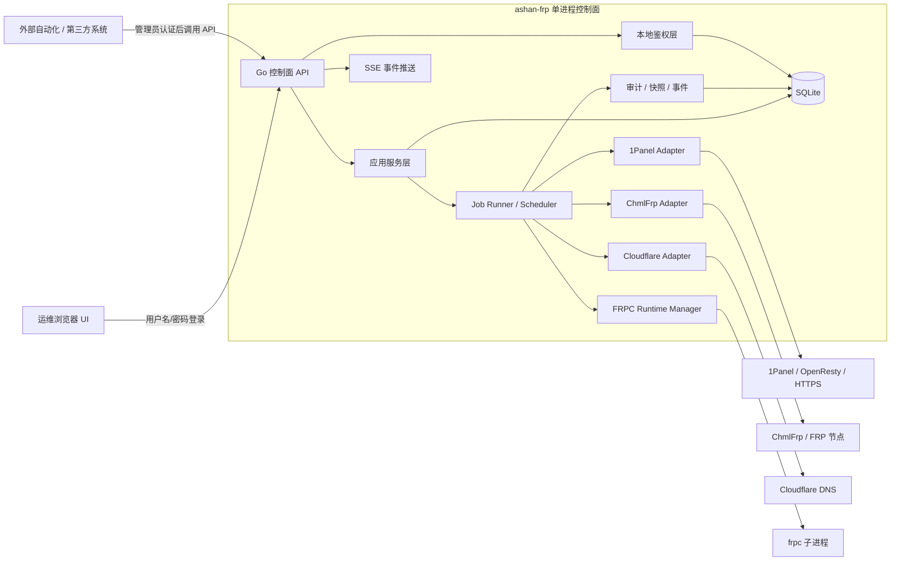
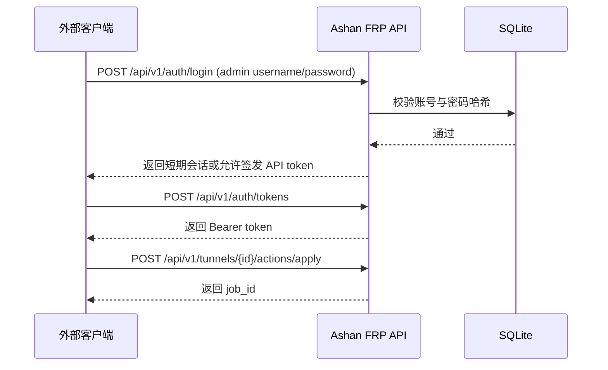

# Ashan FRP 完全重构项目设计稿

> 适用范围：`ashan-frp` 全量重构后的目标产品、目标架构、目标 API、目标鉴权、目标部署形态。
> 性质说明：**本文是目标蓝图，不是当前代码现状复述。** 当前仓库已经切到 Go 主线并内嵌 UI，但仍处于过渡实现；若本文与当前骨架实现冲突，以本文定义的完全重构目标为准。
> 重构立场：**纯 Go、单二进制、内嵌 UI、管理员鉴权、API-first、无兼容保留。**
> 配套文档：`architecture.md`、`design/architecture-diagram.md`、`design/backend-schema.md`、`design/frontend-ui.md`、`design/form-layout-draft.md`、`design/wireframe-draft.md`、`design/api-payload-mapping.md`、`design/code-structure-architecture.md`、`design/job-event-model.md`、`design/frpc-runtime.md`、`design/docker-to-1panel-association.md`。

---

## 1. 一句话定义

**Ashan FRP 要被完全重构成一套面向 Unraid / Docker / 1Panel / FRP 场景的纯 Go 单体管理平台：浏览器 UI 与外部控制 API 共用同一套后端控制面，所有敏感操作都必须建立在本地管理员用户名/密码鉴权之上，最终以单镜像、单进程、单二进制方式部署。**

---

## 2. 重构目标与非目标

### 2.1 强制目标

1. **纯 Go 主线**
   - 不保留 Python 业务实现。
   - 不保留 shell 脚本作为正式控制入口。
   - 前端静态资源通过 `go:embed` 内嵌到 Go 二进制。

2. **单体控制面**
   - 一个 Go 进程同时承载：
     - HTTP API
     - 浏览器 UI
     - 鉴权会话
     - Job Runner
     - SSE 推送
     - FRPC Runtime Manager
     - 1Panel / ChmlFrp / Cloudflare 适配器

3. **管理员鉴权是硬门槛**
   - 浏览器 UI 不允许匿名直接操作。
   - 外部 API 不允许匿名直接控制。
   - 所有写操作、敏感读操作、运行时操作都必须基于**管理员用户名/密码**建立身份后才能执行。

4. **API-first**
   - UI 和外部系统都走正式 API。
   - OpenAPI 是正式合同，不是附属说明。
   - 所有异步动作必须返回 `job_id` 并可追踪。

5. **无兼容保留**
   - 不保留旧 flat demo 结构作为长期并存层。
   - 不保留旧脚本接口名、旧 URL、旧字段别名、旧运行链路。
   - 如需迁移，只允许一次性迁移工具，不允许长期双轨兼容。

6. **部署形态极简**
   - 单镜像。
   - 单数据目录。
   - 单健康检查入口。
   - 支持 Docker / Compose / Unraid / GitHub Actions 自动构建发布。

### 2.2 非目标

1. 不做公开自助注册平台。
2. 不做多租户 SaaS 平台。
3. 不做独立前端服务器。
4. 不做“旧 shell + 新 UI”长期并存模式。
5. 不做对匿名访客开放的管理 API。
6. 不做“为了兼容旧实现而保留 legacy 包 / legacy 路由 / legacy 配置键”。

---

## 3. 当前状态 vs 完全重构目标

| 维度 | 当前仓库状态 | 完全重构目标 |
|---|---|---|
| 语言主线 | 已切到 Go 主线 | 保持纯 Go，彻底删除旧控制路径 |
| HTTP 栈 | 当前为轻量骨架实现 | 收敛为稳定的 Gin / 中间件 / OpenAPI 管理面 |
| 存储 | 当前以 JSON state 为主 | 收敛为 SQLite（GORM 管理）作为正式持久化 |
| 前端 | 已是内嵌 HTML/CSS/JS 骨架 | 完整管理台，登录/会话/资源页/日志/任务齐全 |
| 鉴权 | 仅有凭据字段落点，缺少完整本地认证闭环 | 本地管理员账号密码 + session/token + 审计 + 限流 |
| API | 现有 `/api/v1/*` 骨架已存在 | 完整资源合同 + 外部控制能力 + OpenAPI 文档 |
| 异步 | 已有 jobs/events 雏形 | 完整 job runner / retry / blocked / replay / SSE |
| FRPC | 已有 runtime manager 雏形 | 正式内置 runtime，支持启停/重载/切节点/日志 |
| 外部系统 | 设计上覆盖 1Panel / ChmlFrp / Cloudflare | 适配层模块化、可审计、可重试、可对账 |
| 安全 | 未形成正式安全边界 | 所有管理动作必须先过管理员身份认证 |
| 部署 | 单 Go 镜像方向已形成 | 单镜像生产闭环 + GHCR 自动构建 |

---

## 4. 系统边界与总体架构

### 4.1 参与者

| 参与者 | 角色 | 访问方式 |
|---|---|---|
| 运维管理员 | 使用浏览器管理系统 | `/ui/` + session cookie |
| 外部自动化客户端 | 通过 API 远程控制 | `/api/v1/*` + Bearer token / 管理员登录态 |
| Ashan FRP 控制面 | 本地事实源与执行协调者 | 单 Go 进程 |
| FRPC Runtime | 被控制的本地子进程 | 本地进程管理 |
| 1Panel | 网站 / HTTPS / 反代控制面 | Adapter API |
| ChmlFrp | 节点 / 隧道 / 账号上游 | Adapter API |
| Cloudflare | DNS 记录与代理状态 | Adapter API |

### 4.2 架构图



### 4.3 核心原则

1. **本地状态是事实源**
   - 远端响应只作为观测值、证据和对账输入。
   - 本地数据库才是业务定义与操作轨迹的真理源。

2. **意图与副作用分离**
   - HTTP 请求只负责鉴权、校验、落库、排队。
   - 所有远端副作用交给 job runner。

3. **浏览器 UI 与外部 API 共用同一控制面**
   - 不存在第二套隐藏控制通道。
   - 任何能在 UI 中做的管理动作，原则上都要能通过正式 API 做。

4. **管理员身份是唯一写入口**
   - 匿名只允许极少量健康检查级别访问。
   - 所有管理行为都要能追溯到具体管理员账号。

5. **不保留历史兼容层**
   - 重构完成后，以新结构为唯一结构。

---

## 5. 身份、鉴权与安全设计

### 5.1 根要求

用户明确要求：**前后端之间以及外部通过 API 控制时，都需要管理员用户名/密码。**

因此安全设计必须满足：

- 管理台必须有本地管理员登录页。
- 外部 API 不能匿名直接控制。
- 所有 API token 都必须从管理员身份派生，而不是独立于管理员体系存在。
- 系统初始化时必须有明确的管理员引导机制。

### 5.2 角色模型

v1 先采用简单角色模型：

| 角色 | 说明 | 权限 |
|---|---|---|
| `super_admin` | 初始化管理员 / 全权管理员 | 所有读写、凭据管理、用户管理、系统级操作 |
| `admin` | 日常运维管理员 | 节点/隧道/网站映射/任务/日志/设置读写 |
| `viewer` | 只读观察者（预留） | 只读列表、详情、日志摘要 |

> 初版交付时至少要支持 `super_admin`，`admin`/`viewer` 可以代码结构上预留但不必先开放 UI 管理入口。

### 5.3 启动引导与管理员初始化

首次启动时采用**本地 bootstrap 管理员**机制：

- 如果数据库中不存在任何活动账号：
  - 从 `.env` / 环境变量读取管理员初始化信息。
  - 自动创建第一个 `super_admin`。
- 建议环境变量：

```env
ASHAN_FRP_ADMIN_BOOTSTRAP_USERNAME=admin
ASHAN_FRP_ADMIN_BOOTSTRAP_PASSWORD=change-me-now
ASHAN_FRP_SESSION_SECRET=...
ASHAN_FRP_ENCRYPTION_KEY=...
```

约束：

1. 首次启动后，账号写入数据库，密码只保存哈希值。
2. 默认要求管理员首次登录后修改初始密码。
3. 若数据库已有管理员，则 bootstrap 密码不再覆盖数据库中的真实账号密码。

### 5.4 密码与会话策略

#### 密码

- 使用 `Argon2id` 进行密码哈希。
- 强制最小长度、复杂度与错误次数限制。
- 管理员密码永不明文落库。

#### 会话

浏览器 UI：

- 登录接口：`POST /api/v1/auth/login`
- 登录成功后签发 `HttpOnly + Secure + SameSite=Lax` 的 session cookie。
- 所有修改型请求需要：
  - 合法 session
  - CSRF token（Header）

#### API Token

外部自动化：

- 不允许匿名 token。
- token 必须由管理员登录后创建或由管理员用户名/密码换取。
- 建议复用 `auth_tokens` 表，增加 `token_type`：
  - `session`
  - `api_token`

### 5.5 外部 API 调用方式

外部 API 支持两种模式：

#### 模式 A：管理员用户名/密码登录后换取 Bearer Token（推荐）

1. `POST /api/v1/auth/login`
2. 请求体带管理员 `username` / `password`
3. 返回：
   - session cookie（供浏览器）
   - 或通过专门接口签发 `api_token`（供外部系统）
4. 后续请求统一带：
   - `Authorization: Bearer <token>`

#### 模式 B：管理员会话直接调用（浏览器）

- 浏览器登录后通过 session cookie 调用同一套 `/api/v1/*`。

### 5.6 鉴权边界

| API 分类 | 默认是否公开 | 认证要求 |
|---|---|---|
| `GET /api/v1/health` | 可公开 | 无需登录 |
| `GET /api/v1/version` | 可公开 | 无需登录 |
| `/api/v1/auth/*` | 部分公开 | 登录/登出/当前用户 |
| `GET /api/openapi.json` | 默认受保护 | 管理员登录后访问 |
| `GET /api/docs` | 默认受保护 | 管理员登录后访问 |
| `GET /api/v1/nodes` 等资源查询 | 受保护 | `admin`/`viewer` |
| 所有资源写操作 | 受保护 | `admin`/`super_admin` |
| 凭据读写 | 强保护 | `super_admin` 优先，`admin` 视策略 |
| FRPC 启停/切节点 | 强保护 | `admin`/`super_admin` |
| 外部 API 控制 | 强保护 | 先经管理员身份建立会话或 token |

### 5.7 安全附加要求

1. 登录失败限速与 IP 节流。
2. 关键操作写入 `audit_log`。
3. 上游凭据以加密形式存储，密钥来自 `.env`。
4. UI 不回显敏感密钥，只显示“已配置 / 未配置 / 最近验证结果”。
5. 所有 session / token 都支持吊销、过期和最近使用时间追踪。

---

## 6. 核心业务与数据模型

### 6.1 核心对象

| 对象 | 用途 |
|---|---|
| `accounts` | 本地管理员身份 |
| `auth_tokens` | session / API token |
| `upstream_credentials` | 1Panel / ChmlFrp / Cloudflare 等外部凭据 |
| `nodes` | 节点、上游实例、宿主对象 |
| `tunnels` | FRP 隧道定义与运行状态 |
| `website_mappings` | 容器 / 隧道 到 1Panel 网站对象的映射 |
| `jobs` | 异步动作持久队列 |
| `job_events` | job 过程事件 |
| `sync_state` | 对账、漂移、重试短期记忆 |
| `snapshots` | 远端原始或归一化快照 |
| `audit_log` | 管理行为审计轨迹 |
| `settings` | 非敏感系统配置 |

### 6.2 状态分层原则

1. **期望态**
   - `nodes`
   - `tunnels`
   - `website_mappings`
   - `settings`

2. **过程态 / 观测态**
   - `jobs`
   - `job_events`
   - `sync_state`
   - `snapshots`

3. **身份与安全**
   - `accounts`
   - `auth_tokens`
   - `upstream_credentials`
   - `audit_log`

### 6.3 关键设计点

#### 1）`auth_tokens` 同时承载 session 与 API token

建议增加字段：

- `token_type = session | api_token`
- `scopes_json`
- `expires_at`
- `revoked_at`
- `last_used_at`

这样浏览器和外部系统可以共用统一令牌管理体系。

#### 2）`tunnels` 与 `website_mappings` 仍坚持“期望态 vs 实际态”分离

- `desired_state`：用户想要系统达到什么状态
- `actual_state` / `status`：系统最近观察到的实际状态
- `sync_state`：为什么两者不一致、下一步怎么办

#### 3）凭据与设置严格分离

- `settings` 里不放 secret
- 所有第三方 secret 进入 `upstream_credentials`
- UI 默认只展示掩码与最近验证状态

---

## 7. 功能模块设计

### 7.1 登录与会话模块

目标：建立本地管理员身份入口。

必须包含：

- 登录页
- 当前用户信息接口
- 登出接口
- session 失效提示页
- token 管理页（创建 / 吊销外部 API token）

### 7.2 仪表盘模块

目标：一屏回答“稳不稳、哪有问题、现在是不是卡住了”。

展示内容：

- 节点健康摘要
- 隧道运行摘要
- 网站映射同步摘要
- Job 队列摘要
- 最近错误 / 告警
- SSE 连接状态与最后刷新时间

### 7.3 节点模块

职责：

- 管理节点定义
- 记录 provider、endpoint、地区、状态
- 检查节点健康
- 标记归档 / 禁用

动作：

- 新建 / 编辑 / 归档
- 立即检查
- 查看依赖资源
- 查看最近快照和 job 历史

### 7.4 隧道模块

职责：

- 管理 FRP 隧道定义
- 绑定节点
- 控制本地目标服务、远端端口、域名、代理状态
- 对接 FRPC runtime

动作：

- 新建 / 编辑 / 归档
- 应用
- 启动 / 停止
- 重建
- 切节点
- 手动恢复

### 7.5 网站映射模块

职责：

- 管理 1Panel website 对象映射
- 管理域名、HTTPS、代理目标
- 跟踪 website 漂移与同步状态

动作：

- 新建 / 编辑 / 归档
- 同步 / 重新应用
- 启用 HTTPS / 禁用 HTTPS
- 查看最近 1Panel 原始快照

### 7.6 设置与集成模块

职责：

- 管理系统频率、重试、保留期、默认策略
- 管理 ChmlFrp / 1Panel / Cloudflare 凭据
- 管理外部认证状态

动作：

- 保存非敏感配置
- 保存 / 替换凭据
- 验证凭据
- 查看最近验证结果
- 触发 ChmlFrp 登录 / token 刷新

### 7.7 任务、日志与审计模块

职责：

- 展示所有异步任务状态
- 展示任务时间线
- 展示错误上下文
- 追踪是谁改了什么

动作：

- 查询 job 列表 / 详情
- 查看 job_events
- 查看 audit_log
- 查看 snapshots
- 重新触发失败任务（按策略允许）

### 7.8 对账 / 漂移检测模块

职责：

- 发现多余隧道
- 发现缺失隧道
- 发现远端对象与本地定义不一致
- 发现网站映射被人工改坏或漂移

动作：

- 运行全量扫描
- 查看差异摘要
- 对单个对象执行 reconcile
- 标记 `manual_override`

---

## 8. API 设计

### 8.1 API 分类

#### A. 公共只读 API

- `GET /api/v1/health`
- `GET /api/v1/version`

用途：

- 健康检查
- 容器探针
- 最低限度连通性验证

#### B. 鉴权 API

- `POST /api/v1/auth/login`
- `POST /api/v1/auth/logout`
- `GET /api/v1/auth/me`
- `POST /api/v1/auth/tokens`
- `GET /api/v1/auth/tokens`
- `POST /api/v1/auth/tokens/{id}/revoke`
- `POST /api/v1/auth/password/change`

#### C. 管理资源 API

- `GET/POST/PATCH /api/v1/nodes`
- `GET/POST/PATCH /api/v1/tunnels`
- `GET/POST/PATCH /api/v1/website-mappings`
- `GET/PATCH /api/v1/settings`
- `GET /api/v1/jobs`
- `GET /api/v1/jobs/{id}`
- `GET /api/v1/logs`
- `GET /api/v1/audit`
- `GET /api/v1/reconciliation`

#### D. 运行时动作 API

- `POST /api/v1/nodes/{id}/actions/check`
- `POST /api/v1/tunnels/{id}/actions/apply`
- `POST /api/v1/tunnels/{id}/actions/start`
- `POST /api/v1/tunnels/{id}/actions/stop`
- `POST /api/v1/tunnels/{id}/actions/recreate`
- `POST /api/v1/website-mappings/{id}/actions/sync`
- `POST /api/v1/website-mappings/{id}/actions/reapply`
- `POST /api/v1/website-mappings/{id}/actions/enable-https`
- `POST /api/v1/website-mappings/{id}/actions/disable-https`
- `POST /api/v1/frpc/runtime/actions/start`
- `POST /api/v1/frpc/runtime/actions/stop`
- `POST /api/v1/frpc/runtime/actions/restart`
- `POST /api/v1/frpc/runtime/actions/reload`
- `POST /api/v1/frpc/runtime/actions/switch-node`

#### E. 实时 API

- `GET /api/v1/events/stream`

### 8.2 统一响应 envelope

```json
{
  "data": {},
  "meta": {
    "request_id": "req_...",
    "trace_id": "trc_...",
    "job": {
      "id": "job_...",
      "status": "queued",
      "channel": "subject:tunnel:tun_..."
    }
  },
  "error": null
}
```

### 8.3 登录接口示例

#### 请求

```http
POST /api/v1/auth/login
Content-Type: application/json

{
  "username": "admin",
  "password": "******",
  "mode": "session"
}
```

#### 响应

```json
{
  "data": {
    "account": {
      "id": "acc_01...",
      "login_name": "admin",
      "role": "super_admin"
    },
    "auth": {
      "mode": "session",
      "expires_at": "2026-06-30T12:00:00Z"
    }
  },
  "meta": {
    "request_id": "req_...",
    "trace_id": "trc_..."
  }
}
```

### 8.4 外部 API 认证流



### 8.5 OpenAPI 策略

- OpenAPI 是正式控制合同。
- 默认要求管理员登录后才能查看 `/api/openapi.json` 与 `/api/docs`。
- Swagger 页面必须清楚标出：
  - 哪些接口只读
  - 哪些接口写入
  - 哪些接口异步返回 `job_id`
  - 哪些接口需要 `super_admin`

---

## 9. UI 设计摘要

### 9.1 页面地图

| 页面 | 目的 |
|---|---|
| 登录页 | 本地管理员用户名/密码登录 |
| 仪表盘 | 全局健康、任务、异常概览 |
| 节点列表 / 详情 | 管理节点与依赖 |
| 隧道列表 / 详情 | 管理隧道定义与运行态 |
| 网站映射列表 / 详情 | 管理 1Panel 网站对象与 HTTPS |
| 任务队列 / 详情 | 管理异步执行轨迹 |
| 日志 / 审计 | 查看故障证据 |
| 设置页 | 管理系统策略与凭据 |
| API Token 页 | 管理外部自动化令牌 |
| 403 / 会话过期页 | 权限与登录态异常 |

### 9.2 前后端协作原则

1. 浏览器 UI 只调正式 API。
2. 所有修改型动作都明确显示：
   - 已提交
   - 排队中
   - 执行中
   - 成功
   - 失败
3. UI 不直接保存任何长期 secret 明文。
4. 凭据页只显示掩码、状态、最近验证时间、最近错误。

### 9.3 登录态与异常态

全局状态栏需要显示：

- 当前用户名 / 角色
- SSE 已连接 / 回退轮询
- 最近刷新时间
- 会话是否即将过期

当会话失效时：

- 页面顶部显示全局 banner
- 所有写操作按钮立即禁用
- 引导重新登录

---

## 10. 运行时设计

### 10.1 单进程组成

一个 Go 进程内至少有以下组件：

- Gin HTTP Server
- Auth Middleware
- Service Container
- GORM Repository Layer
- Job Runner
- Scheduler
- SSE Broker
- FRPC Runtime Manager
- 1Panel Adapter
- ChmlFrp Adapter
- Cloudflare Adapter

### 10.2 并发模型

采用 goroutine 驱动：

- HTTP 请求 goroutine
- SSE 广播 goroutine
- Job Runner worker goroutine
- 定时调度 goroutine
- FRPC 状态监控 goroutine

### 10.3 FRPC Runtime

FRPC Runtime Manager 负责：

- 生成配置
- 启动 / 停止 `frpc` 子进程
- reload / restart
- 切节点
- 收集 stdout/stderr 到 runtime 日志
- 将关键信息回写到 `jobs` / `job_events` / `sync_state`

### 10.4 数据目录

建议统一为：

```text
/app/data/
├── app.db
├── backups/
├── frpc/
│   ├── bin/
│   ├── conf/
│   └── logs/
├── exports/
└── tmp/
```

说明：

- `app.db`：SQLite 正式状态库
- `frpc/`：本地 runtime 运行文件
- `backups/`：数据库备份或导出
- `tmp/`：临时任务文件

---

## 11. 技术栈与代码结构目标

### 11.1 目标技术栈

| 层 | 选择 |
|---|---|
| HTTP | Gin |
| ORM / DB | GORM + SQLite |
| 并发 | goroutine + channel + context |
| 静态资源 | `go:embed` |
| 前端 | HTML / CSS / JavaScript |
| 文档 | OpenAPI / Swagger |
| 日志 | 结构化日志 |
| 密码哈希 | Argon2id |

### 11.2 目标目录

```text
frp-backend/
├── cmd/ashan-frp/
├── internal/bootstrap/
├── internal/config/
├── internal/domain/
├── internal/application/
├── internal/repository/
├── internal/integration/
├── internal/runtime/frpc/
├── internal/worker/
├── internal/http/
│   ├── middleware/
│   ├── handlers/
│   ├── dto/
│   ├── response/
│   └── openapi/
├── internal/events/
├── internal/audit/
├── internal/observability/
└── internal/web/dist/
```

### 11.3 明确删除项

重构完成后必须删除：

- 旧 JSON state-only 主路径
- 旧 flat demo 包结构残余
- 旧脚本控制入口
- 旧独立前端假设
- 旧兼容路由与旧字段别名

---

## 12. 部署与交付设计

### 12.1 Docker 交付

目标镜像：

- 单容器
- 单入口命令
- 自带 UI / API
- 健康检查走 `/api/v1/health`

### 12.2 环境变量

建议核心环境变量：

```env
ASHAN_FRP_HTTP_ADDR=:8080
ASHAN_FRP_DATA_DIR=/app/data
ASHAN_FRP_DATABASE_DSN=/app/data/app.db
ASHAN_FRP_SESSION_SECRET=...
ASHAN_FRP_ENCRYPTION_KEY=...
ASHAN_FRP_ADMIN_BOOTSTRAP_USERNAME=admin
ASHAN_FRP_ADMIN_BOOTSTRAP_PASSWORD=change-me
```

### 12.3 Compose / Unraid

必须支持：

- `/app/data` 挂载持久化
- `8080` 暴露 UI/API
- 单健康检查
- GHCR 镜像直接部署

### 12.4 GitHub Actions

CI/CD 至少包含：

1. Go test
2. Go build
3. OpenAPI 生成/校验
4. Docker buildx
5. GHCR push
6. `latest` + `sha` + `branch` 标签发布

---

## 13. 迁移与落地顺序（无兼容保留版）

### 阶段 1：搭新骨架

1. 引入 Gin / GORM / SQLite 正式结构。
2. 建立 `accounts` / `auth_tokens` / `upstream_credentials` 基础表。
3. 实现管理员 bootstrap。
4. 实现登录 / 会话 / token 吊销。

### 阶段 2：把控制面先立住

1. 收敛 `/api/v1/auth/*`
2. 收敛 `/api/v1/health` / `/api/v1/version`
3. 收敛 `/api/openapi.json` / `/api/docs`
4. 让浏览器 UI 必须先登录再进入管理台

### 阶段 3：资源模型迁移

1. `nodes`
2. `tunnels`
3. `website_mappings`
4. `settings`
5. `jobs` / `job_events` / `sync_state` / `snapshots` / `audit_log`

### 阶段 4：运行时与外部系统

1. FRPC Runtime Manager
2. ChmlFrp Adapter
3. 1Panel Adapter
4. Cloudflare Adapter
5. Reconciliation / drift detection

### 阶段 5：清理旧世界

1. 删除旧 JSON 主存储路径
2. 删除旧兼容 DTO
3. 删除旧控制脚本入口
4. 删除所有 legacy 文档口径

> 如果需要把当前 `state.json` 数据迁入 SQLite，只允许提供一次性导入工具；导入完成后旧格式不再继续支持。

---

## 14. 验收标准

只有满足以下条件，才算“完全重构设计对应的产品形态已成立”：

1. **浏览器进入管理台前必须先登录管理员账号密码。**
2. **外部系统必须通过管理员身份建立 token 或会话后，才能控制 API。**
3. **节点 / 隧道 / 网站映射 / 设置 / 任务 / 日志都有正式 API 与 UI。**
4. **所有副作用型操作都会返回 `job_id` 并可追踪。**
5. **所有关键行为都有审计记录。**
6. **所有第三方凭据都加密存储，UI 不明文回显。**
7. **系统是单镜像、单二进制、单数据目录部署。**
8. **OpenAPI 能完整表达正式控制合同。**
9. **旧脚本入口、旧兼容路径、旧 legacy 结构全部删除。**

---

## 15. 文档边界与后续拆分

本文是**总设计稿**，后续仍保持文档分层：

- `full-rebuild-design.md`：总蓝图、总边界、总原则
- `architecture.md`：系统总览与分层关系
- `design/backend-schema.md`：表与索引
- `design/frontend-ui.md`：页面地图与交互
- `design/form-layout-draft.md`：表单字段顺序与分区
- `design/api-payload-mapping.md`：DTO / 请求体 / 响应体 / 动作接口
- `design/code-structure-architecture.md`：包结构与依赖方向
- `design/job-event-model.md`：任务状态机与事件模型
- `design/frpc-runtime.md`：FRPC 运行时
- `design/docker-to-1panel-association.md`：站点发布链路

当这些文档与本文冲突时：

1. 先以本文的**完全重构目标**为准；
2. 再逐份把配套文档修订到一致；
3. 不允许通过保留“旧说法也算对”来掩盖冲突。

---

## 16. 最终结论

Ashan FRP 的最终形态，不是“补几个接口的 Go demo”，而是：

> **一个纯 Go 的、带本地管理员用户名/密码鉴权的、可被浏览器和外部系统共同操作的、单二进制 FRP 管理控制面。**

它必须统一解决：

- 本地登录与外部 API 控制
- 节点 / 隧道 / 网站映射管理
- FRPC 运行时控制
- 1Panel / ChmlFrp / Cloudflare 集成
- 任务、日志、审计、对账
- 单镜像部署与 GitHub 自动构建

并且**不保留旧兼容层，不保留旧脚本主路径，不保留匿名控制入口。**
